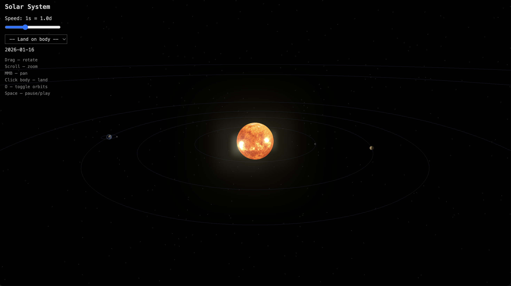

# Solar Space

**An interactive 3D Solar System visualization you can explore from orbit — or walk on the surface of any planet.**

[](https://threejs.org/)
[](https://vitejs.dev/)
[](https://developer.mozilla.org/en-US/docs/Web/JavaScript)
[](LICENSE)

<!-- Replace with your own screenshot or GIF -->


## Features

- **15 celestial bodies** — Sun, 8 planets, and 6 moons rendered with NASA texture maps
- **Astronomically accurate orbits** — real orbital periods and positions based on J2000 epoch, starting Jan 1, 2026
- **Surface walking** — land on any body and explore with FPS-style controls (WASD + mouse look)
- **Free orbital camera** — orbit, zoom, pan, and click any body to land on it
- **Time simulation** — speed from 1s = 1 hour up to 1s = 1 year, with pause/play
- **Real star catalog** — ~9,000 stars from the [HYG Database](https://github.com/astronexus/HYG-Database) with accurate positions, spectral colors, and magnitude-based brightness (brightest stars trigger bloom glow)
- **Star identification** — hover over the 500 brightest stars to see their name and distance in light-years
- **Visual effects** — bloom glow, atmospheric shaders, lens flare, soft shadows, and Saturn's rings
- **Orbit lines** — toggle orbital path visualization

## Controls

### Free Camera (default)

| Input | Action |
|-------|--------|
| Left drag | Rotate view |
| Scroll | Zoom in/out |
| Middle mouse | Pan |
| Click a body | Land on surface |
| `O` | Toggle orbit lines |
| `Space` | Pause / play time |

### Surface Mode

| Input | Action |
|-------|--------|
| `W` `A` `S` `D` | Walk |
| `Shift` | Run |
| Mouse | Look around |
| `F` | Return to orbit view |

## Getting Started

```bash
git clone https://github.com/astroboyfromspace/solar-space.git
cd solar-space
npm install
npm run dev
```

The dev server opens the app in your browser automatically.

### Other Commands

| Command | Description |
|---------|-------------|
| `npm run build` | Production build to `/dist` |
| `npm run preview` | Preview the production build |
| `npm run generate-stars` | Regenerate star catalog from HYG Database |

## Tech Stack

- **Three.js** — 3D rendering, PBR materials, shadow mapping, post-processing
- **Vite** — dev server and bundler
- **Vanilla JS** — no frameworks, ES modules throughout
- **WebGL** — GPU-accelerated rendering with logarithmic depth buffer
- **NASA texture maps** — planetary surface imagery

## License

[MIT](LICENSE)
